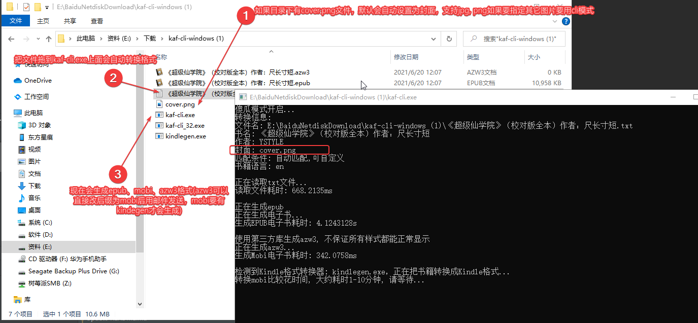
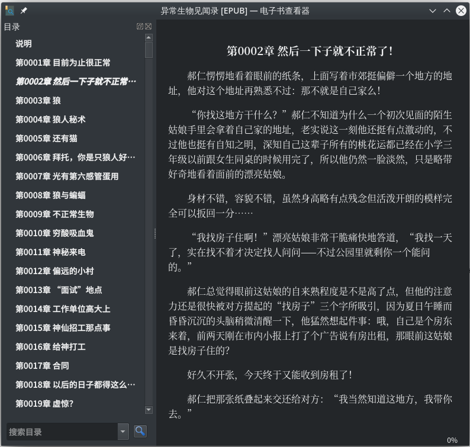

## kaf-cli

> 把 txt 文本转成 epub / mobi / azw3 电子书的命令行工具

本项目 fork 自 [ystyle/kaf-cli](https://github.com/ystyle/kaf-cli)，在保留原有功能的基础上增加了 Windows 图形界面与章节目录优化等改进。

目录说明见 [docs/STRUCTURE.md](docs/STRUCTURE.md)。

### 本 fork 新增

- **Windows 图形版 `kaf-cli-wails.exe`**：选择 TXT/封面、作者、输出格式；系统/AI 统一设置弹窗；记住上次选项
- **章节目录去重 `-dedup-title`**：合并「目录行 + 正文标题行」重复章节（默认开启）
- **对话引号优化 `-normalize-quotes`**：正文 `「」` 转为 `“”`（默认关闭，不影响【】）
- **「第X部」分篇处理**：单独一行的 `第一部`、`第三部` 不再误入 EPUB 目录
- **构建输出**：`build/windows-amd64/` 统一存放 exe；`.\build.ps1` 一键编译

### 功能

- 傻瓜操作模式（把 txt 文件拖到 `kaf-cli.exe` 上面自动转换）
- Windows 图形界面（`kaf-cli-wails.exe`）
- 自定义封面
- 支持生成 Orly 风格的书籍封面
- 自动识别书名和章节
- 自动识别字符编码（自动解决中文乱码）
- 合并连续重复的章节目录行（`-dedup-title`）
- 自定义章节标题识别规则
- 自定义卷的标题识别规则
- 自动给章节正文生成加粗居中的标题
- 自定义标题对齐方式
- 段落自动识别、自动缩进
- 自定义段落缩进字数、段落间距、行间距
- 自定义书籍语言
- epub 格式支持嵌入字体
- 知轩藏书格式文件名会自动提取书名和作者，例：`《希灵帝国》（校对版全本）作者：远瞳.txt`
- 超快速（130 章/s 以上速度，4000 章 30s 不到）
- 自动转为 mobi / azw3 格式

### 下载

- **本 fork 发布页**：[flylink-code/kaf-cli Releases](https://github.com/flylink-code/kaf-cli/releases/latest)
- 上游原版：[ystyle/kaf-cli Releases](https://github.com/ystyle/kaf-cli/releases/latest)
- 手机版 kaf：[Github 下载](https://github.com/ystyle/kaf-cli/releases/tag/android)
- 电脑版 wifi 传书 kaf-wifi：[Github 下载](https://github.com/ystyle/kaf-wifi/releases/latest)

Windows 压缩包内包含：

| 文件 | 说明 |
|---|---|
| `kaf-cli.exe` | 64 位命令行版（支持拖拽 txt） |
| `kaf-cli-wails.exe` | 64 位图形界面版（WebView2，仅 Windows） |
| `kindlegen.exe` | mobi 转换工具（如有） |

另外，GitHub Release 提供 `kaf-cli-vX.Y.Z-windows-x64-setup.exe` 安装包。安装程序支持选择安装目录，并创建桌面和开始菜单快捷方式。安装版可在图形界面右上角的帮助菜单中查看版本并检查更新；发现新版本后，程序会从本项目的 GitHub Release 下载并启动安装程序完成升级。

### 本地编译

需要 Go 1.21+。

```powershell
# Windows（根目录快捷方式，实际脚本在 scripts/）
.\build.ps1
# 或
.\scripts\build.ps1
```

编译产物在 `build/` 目录（与 CI 结构一致）：

| 路径 | 说明 |
|---|---|
| `build/windows-amd64/kaf-cli.exe` | 64 位 CLI |
| `build/windows-amd64/kaf-cli-wails.exe` | 64 位 Wails GUI（需本机安装 Wails CLI） |
| `build/windows-386/kaf-cli.exe` | 32 位 CLI |

日常使用可将 `build/windows-amd64/` 下的 exe 复制到工作目录，或直接把 txt 拖到该目录中的 `kaf-cli.exe` 上。

> Wails 版需 [Wails v2](https://wails.io/) 与 WebView2；`.\build.ps1` 在检测到 `wails` 命令时会一并编译 GUI。

### 使用方法

#### 图形界面（Windows）

1. 运行 `build/windows-amd64/kaf-cli-wails.exe`
2. 选择 TXT、封面、作者；顶部 **设置** 打开配置弹窗
3. 选择输出格式后点击「开始转换」；完成后可打开输出目录
4. 选项保存在 `%AppData%\kaf-cli\gui-config.json`

#### 拖拽 / 命令行

1. 解压，把小说直接拖到 `kaf-cli.exe` 文件上面
2. 等转换完，目录下会生成 epub、azw3、mobi 文件
   - mobi 格式需要有 kindlegen 才会生成（windows、mac 版本发布包通常自带）
3. 自定义封面：拖拽模式下，若目录下有 `cover.png`、`cover.jpg` 或 `cover.jpeg` 会自动添加为封面
4. 其它自定义功能请用命令行模式

### 效果




### 命令行模式参数

```text
Usage of kaf-cli:
  -align string
        标题对齐方式: left、center、righ。环境变量 KAF_CLI_ALIGN 可修改默认值 (default "center")
  -author string
        作者 (default "YSTYLE")
  -bookname string
        书名: 默认为 txt 文件名
  -bottom string
        段落间距(单位可以为 em、px) (default "1em")
  -cover string
        封面图片可为: 本地图片, 和 orly。设置为 orly 时生成 orly 风格的封面, 需要连接网络。默认会优先尝试 cover.png，其次 cover.jpg、cover.jpeg。(default "cover.png")
  -cover-orly-color string
        orly 封面的主题色, 可以为 1-16 和 hex 格式的颜色代码, 不填时随机
  -cover-orly-idx int
        orly 封面的动物, 可以为 0-41, 不填时随机 (default -1)
  -dedup-title
        合并连续重复的章节目录行（同章号且上一节无正文）(default true)
  -normalize-quotes
        正文对话引号优化：「」转为 “”（不影响【】）(default false)
  -filename string
        txt 文件名
  -font string
        嵌入字体, 之后 epub 的正文都将使用该字体
  -format string
        书籍格式: all、epub、mobi、azw3。环境变量 KAF_CLI_FORMAT 可修改默认值 (default "all")
  -indent uint
        段落缩进字数 (default 2)
  -lang string
        设置语言: en,de,fr,it,es,zh,ja,pt,ru,nl。环境变量 KAF_CLI_LANG 可修改默认值 (default "zh")
  -line-height string
        行高(用于设置行间距, 默认为 1.5rem)
  -match string
        匹配标题的正则表达式, 不写可以自动识别
  -max uint
        标题最大字数 (default 35)
  -out string
        输出文件名，不需要包含格式后缀
  -tips
        添加本软件教程 (default true)
  -unknow-title string
        未知章节默认名称 (default "章节正文")
  -volume-match string
        卷匹配规则, 设置为 false 可以禁用卷识别
```

> PS: 在 darwin(mac、osx) 上 `-tips` 参数要设置为 false：`kaf-cli -filename 小说.txt -tips=0`

### 命令行示例

转换 `全职法师.txt`，并设置作者名为 `乱`：

```shell
# Windows
kaf-cli.exe -author 乱 -filename 全职法师.txt

# 简单模式（等同拖拽）
kaf-cli.exe 全职法师.txt

# 关闭章节目录去重
kaf-cli.exe -filename 全职法师.txt -dedup-title=false
```

### 「第X部」分篇标注

正文中单独一行的 `第一部`、`第三部` 等**不会**被识别为章节或卷（避免 EPUB 目录出现多余书签）。仍支持 `第一卷`、`第1章` 等。若需把带书名的分部当卷，可用 `-volume-match` 自定义规则。

### 章节目录去重说明

部分小说每章开头有两行相似标题，例如：

```text
第1章 一章「标题」
　　第1章 一章·「标题」
```

开启 `-dedup-title`（默认）后，会跳过无正文的重复目录行，避免 EPUB 目录章节翻倍。

### 对话引号优化说明

部分网文对话使用 `「」`，开启 `-normalize-quotes` 后正文会替换为 `“”`，`【】` 系统提示不变。章节标题行不替换。

### AI 优化（图形界面，可选）

> AI 是规则引擎的**可选后处理增强**，默认关闭，离线不影响转换。

图形版（`kaf-cli-wails.exe`）支持接入 OpenAI 兼容的 AI 服务，在规则解析完成后做进一步优化。在 **设置** 弹窗中填入：

| 项 | 说明 |
|---|---|
| Base URL | OpenAI 兼容地址，如 `https://api.deepseek.com/v1`；留空用 OpenAI 官方 |
| Model | 如 `deepseek-chat` / `gpt-4o-mini` / `qwen-plus` |
| API Key | 仅本地保存，不随书籍上传 |
| 抽样上限 | 正文抽样字符数；`0` 表示只分析章节标题（最省 token） |

可勾选的 4 个任务（默认仅勾「章节结构分析」）：

- **章节结构分析**：本地规则先扫描水印/重复章号/空目录等疑点，仅把可疑片段的标题送 AI 复核并修正 `SectionList`；无疑点则 0 次请求。
- **排版细节修正**：抽样前几章诊断排版问题（引号、省略号、全半角等），生成替换规则后本地全量应用。
- **噪音内容清理**：识别广告/水印/采集站尾巴等噪音特征，本地按特征删行。
- **生成书籍简介**：基于正文生成简介，写入 epub 的描述字段。

**降级保证**：任一任务失败都会告警并跳过，绝不中断转换；最坏情况下沿用规则引擎结果。AI 进度会实时显示在转换日志中。

> **隐私**：API Key 经 Windows DPAPI 加密后保存在 `%AppData%\kaf-cli\gui-config.json`，仅当前 Windows 账户可解密（换机器/账户后需重填）；文件权限 `0600`。错误日志中疑似 key 的片段会自动打码。仅调用 AI 时会把章节标题/抽样正文发送到你所配置的服务；封面生成与统计等非 AI 出站请求均不携带 key。

### 自定义章节匹配规则

规则支持[正则表达式](http://deerchao.net/tutorials/regex/regex.htm)。

```shell
# 章节格式为 第x节
kaf-cli.exe -filename ebook.txt -match "第.{1,8}节"

# 章节格式为 Section 1 ~ Section 100
kaf-cli.exe -filename ebook.txt -match "Section \d+"

# 章节格式为 Chapter xxx
kaf-cli.exe -filename ebook.txt -match "Chapter .{1,8}"
```

### 手动把书转为 kindle 的 mobi 格式

> 新版如果检测到有 kindlegen 程序时会自动转为 mobi

1. 下载 [kindlegen](https://github.com/ystyle/kaf-cli/releases/kindlegen/)（github 备份，官网已经不提供下载）
2. 放到与 `kaf-cli.exe` 同目录，或 PATH 中
3. 也可手动执行：`kindlegen.exe 全职法师.epub`

### 致谢

- 原版项目：[ystyle/kaf-cli](https://github.com/ystyle/kaf-cli)
- 教程：[txt 转 epub 和 mobi](https://ystyle.top/2019/12/31/txt-converto-epub-and-mobi/)
